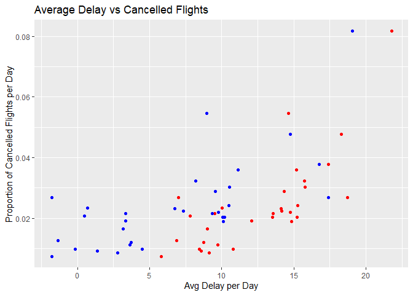

STAT 433 HW2
================
Caitlin Bolz
2/10/2021


``` r
library(dplyr)
```

    ## 
    ## Attaching package: 'dplyr'

    ## The following objects are masked from 'package:stats':
    ## 
    ##     filter, lag

    ## The following objects are masked from 'package:base':
    ## 
    ##     intersect, setdiff, setequal, union

``` r
library(nycflights13)
library(ggplot2)
```

# Question 1

How many flights have a missing dep\_time? What other variables are
missing? What might these rows represent?

8,255 rows with missing dep\_time. They also have missing dep\_delay,
arr\_time, arr\_delay, and air\_time. These rows represent flights that
never took off, so canceled flights.

``` r
flights %>% filter(is.na(dep_time))
```

    ## # A tibble: 8,255 x 19
    ##     year month   day dep_time sched_dep_time dep_delay arr_time sched_arr_time
    ##    <int> <int> <int>    <int>          <int>     <dbl>    <int>          <int>
    ##  1  2013     1     1       NA           1630        NA       NA           1815
    ##  2  2013     1     1       NA           1935        NA       NA           2240
    ##  3  2013     1     1       NA           1500        NA       NA           1825
    ##  4  2013     1     1       NA            600        NA       NA            901
    ##  5  2013     1     2       NA           1540        NA       NA           1747
    ##  6  2013     1     2       NA           1620        NA       NA           1746
    ##  7  2013     1     2       NA           1355        NA       NA           1459
    ##  8  2013     1     2       NA           1420        NA       NA           1644
    ##  9  2013     1     2       NA           1321        NA       NA           1536
    ## 10  2013     1     2       NA           1545        NA       NA           1910
    ## # ... with 8,245 more rows, and 11 more variables: arr_delay <dbl>,
    ## #   carrier <chr>, flight <int>, tailnum <chr>, origin <chr>, dest <chr>,
    ## #   air_time <dbl>, distance <dbl>, hour <dbl>, minute <dbl>, time_hour <dttm>

# Question 2

Currently dep\_time and sched\_dep\_time are convenient to look at, but
hard to compute with because they’re not really continuous numbers.
Convert them to a more convenient representation of number of minutes
since midnight.

``` r
flights$dep_time = (floor(flights$dep_time/100)*60 + flights$dep_time %% 100)

flights$sched_dep_time = (floor(flights$sched_dep_time/100)*60 + 
                            flights$sched_dep_time %% 100)
```

# Question 3

Look at the number of canceled flights per day. Is there a pattern? Is
the proportion of canceled flights related to the average delay? Use
multiple dyplr operations, all on one line, concluding with
\`ggplot(aes(x= ,y=)) + geom\_point()’

``` r
flights %>%
  group_by(day) %>%
  summarise(cancelled = mean(is.na(dep_delay)),
            mean_dep = mean(dep_delay, na.rm = T),
            mean_arr = mean(arr_delay, na.rm = T)) %>%
  ggplot(aes(y = cancelled)) +
  geom_point(aes(x = mean_dep), colour = "red") +
  geom_point(aes(x = mean_arr), colour = "blue") +
  labs(x = "Avg Delay per Day", y = "Proportion of Cancelled Flights per Day", title = "Average Delay vs Cancelled Flights")
```

<!-- -->
